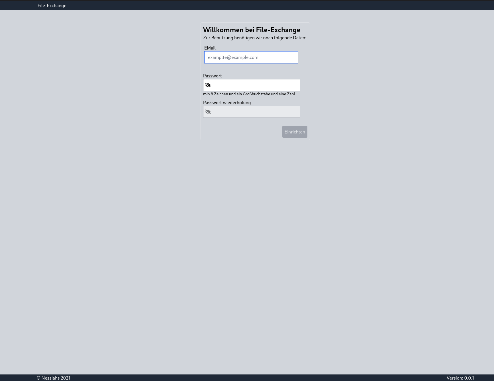
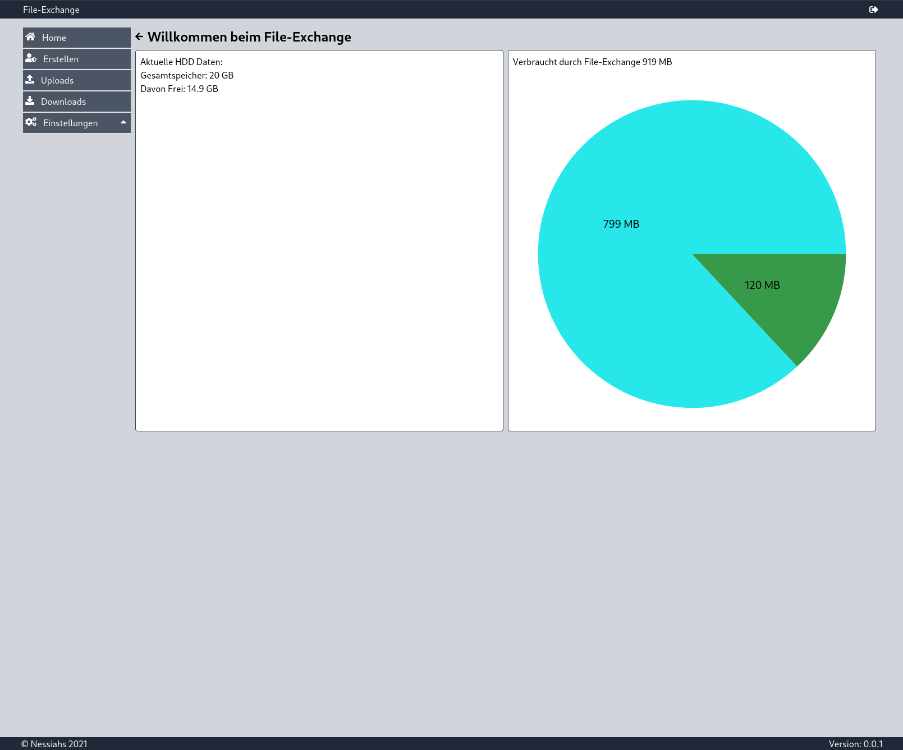
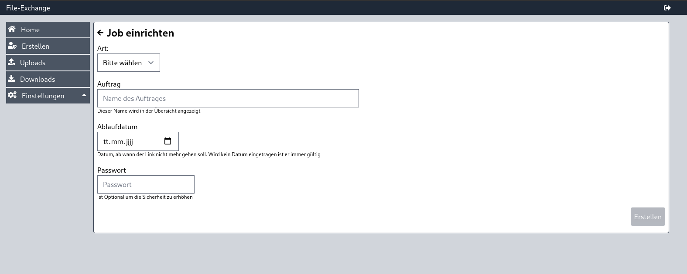
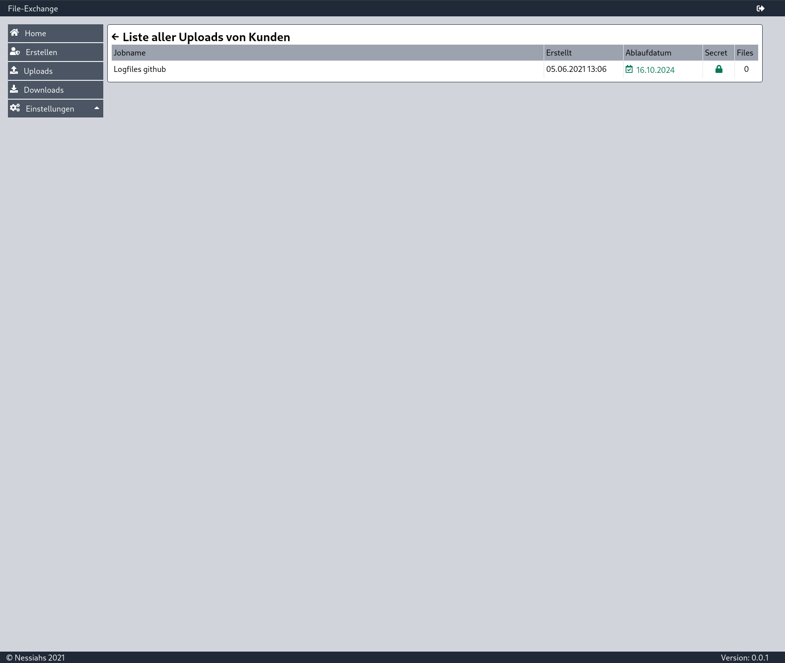
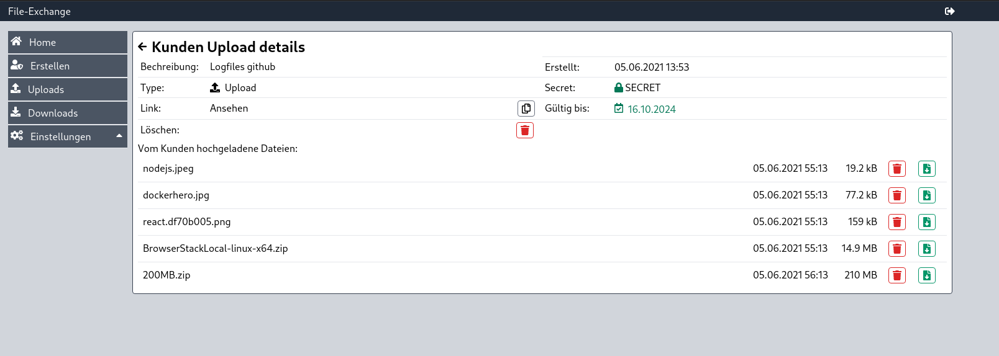
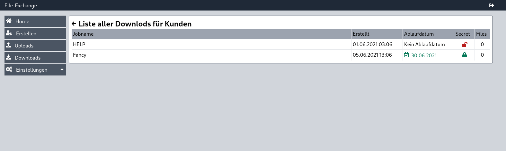
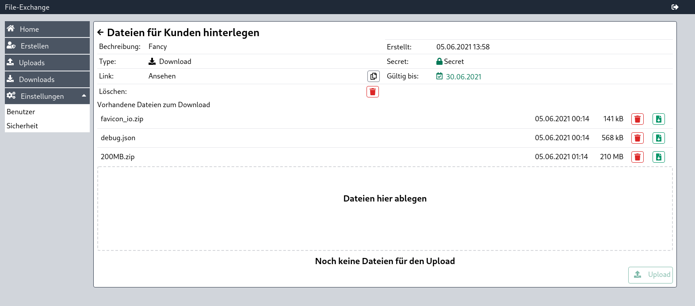
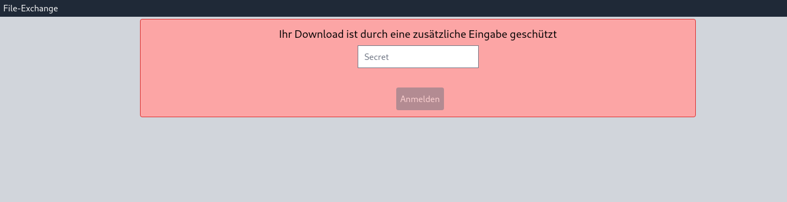

[](https://www.codacy.com/gh/Nessiahs/file-exchange-ui/dashboard?utm_source=github.com&utm_medium=referral&utm_content=Nessiahs/file-exchange-ui&utm_campaign=Badge_Grade)

# file-exchange-ui

## So gelingt DSGVO-konformer Datenaustausch

Die EU-DSGVO ist bereits am 25.05.2016 in Kraft getreten. Bei Verstößen drohen verheerende Bußgelder von bis zu 20 Millionen Euro oder bis zu 4 % des gesamten weltweit erzielten Jahresumsatzes sowie ein großer Reputationsverlust in der Öffentlichkeit.

### Dies hier ist die Bedienoberfläche zum Datenaustausch

Beinhaltet:

- Adminoberfläche
- Kunden-Upload
- Kunden-Download

[Zum Backend](https://github.com/Nessiahs/file-exchange-backend)

## Features:

- Es werden keine Cookies benötigt
- Dateien werden im Backend verschlüsselt gespeichert
- Jede Installation hat ihre eigene Schlüssel zur Verschlüsselung
- Datenaustausch einfach per Link
- Zusätzlich kann jeder Upload / Download über ein Secret abgesichert werden
- Zugriff auf die Backend-Api kann nur für bestimmte IP-Adressen freigegeben werden
- Es gibt Admin und User Rolle für das Backend

## Best Practice Server Setup

Es wird Empfohlen dass, das Frontend separat von der Api gehostet wird. Dafür benutze ich folgendes Setup:

NGINX als SSL-Terminierung. Dahinter dann ein Node.js Server mit dem Backend und ein weiterer NGINX für das Frontend. Hierzu eignet sich ein Docker-Setup sehr gut.

[docker-compose](https://github.com/Nessiahs/file-exchange-compose), die dieses Setup zu Verfügung stellt

## Umgebungsvariablen

Folgende Umgebungsvariablen können in der .env Datei gesetzt werden:

Key für den Session-Storage um den Token zu speichern

`REACT_APP_STORAGE_KEY='file-upload'`

Pfad zur API für die Ajax-Requests

`REACT_APP_API_URI='/api/'`

## Installation

Es wird ein System mit Node.js Version 14 benötigt.

```bash
  git clone https://github.com/Nessiahs/file-exchange-ui.git
  cd file-exchange-ui
  yarn install
  yarn build
```

Im Ordner `build` befinden sich dann alle Files, die auf den Webserver zu übertragen sind.

## Inbetriebnahme

Die Oberfläche zum Verwalten der Down/Uploads ist unter dem Pfad `/admin/` zu finden. Beim ersten Aufruf dieser URL, erscheint folgender Screen:



Nach Eingabe dieser Daten und Übermittlung, wird auf dem Server die Datenbank eingerichtet und ein Schlüssel für die Verschlüsselung erstellt. Nach der Einrichtung sollte die Datenbank gesichert werden. Geht dieser Schlüssel verloren, kann keine der Dateien mehr entschlüsselt werden.

## Screenshots















## Status

Dieses Projekt befindet sich noch in der Entwicklung, kann jedoch eingesetzt werden.

## Authors

- [@Nessiahs](https://www.github.com/Nessiahs)

## License

[MIT](https://github.com/Nessiahs/file-exchange-ui/blob/master/LICENSE)
